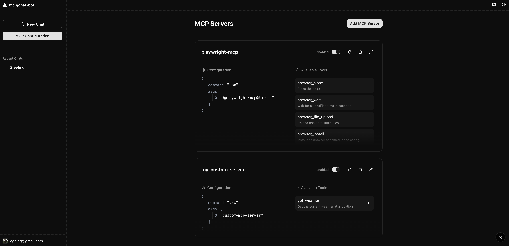

# MCP Client Chatbot

**English** | [한국어](./docs/ko.md)

MCP Client Chatbot is a chat interface that allows you to easily utilize various AI providers ([OpenAI](https://openai.com/), [Anthropic](https://www.anthropic.com/), [Google](https://ai.google.dev/), [Ollama](https://ollama.com/), etc.) while connecting powerful AI tools through [Model Context Protocol (MCP)](https://modelcontextprotocol.io/introduction).

> This project was developed using Vercel's open source libraries such as [Next.js](https://nextjs.org/) and [AI SDK](https://sdk.vercel.ai/)[shadcn/ui](https://ui.shadcn.com/), and is designed to run immediately in local environments or personal servers without complex setup. You can easily add and experiment with AI tools through file-based MCP management.


*Demo showcasing the MCP Client Chatbot with [Microsoft's playwright-mcp](https://github.com/microsoft/playwright-mcp) integration*

**with the prompt:** 

`"Instead, search for 'mcp' on Google, take a screenshot, close it, and then summarize the contents for me."`

## Installation

This project uses [pnpm](https://pnpm.io/) as the recommended package manager.

### Quick Start

```bash
# Install dependencies
pnpm i

# Initialize the project (creates .env file from .env.example and sets up the database)
pnpm initial

# Start the development server
pnpm dev
```

After running these commands, you can access the application at http://localhost:3000.

### Environment Setup

After running `pnpm initial`, make sure to edit your `.env` file to add the necessary API keys for the providers you want to use:

```
GOOGLE_GENERATIVE_AI_API_KEY=****
OPENAI_API_KEY=****
```

By default, the application uses SQLite for data storage. If you prefer to use PostgreSQL, you can modify the `USE_FILE_SYSTEM_DB` value in your `.env` file and set up your database connection string.


### Setting Up MCP Servers

You can add MCP servers in two ways:

1.  Using the UI: Navigate to http://localhost:3000/mcp in your browser and use the interface to add and configure MCP servers.
2.  Editing the config file: Directly modify the `mcp.config.json` file in the project root directory.
3.  Custom server logic: A customizable MCP server is already included in the project at `./custom-mcp-server/index.ts`.  
    You can modify this file to implement your own server logic or connect external tools as needed.



### Let's gooo 🚀

---

## Contributing

> Contributions to MCP Client Chatbot are welcome and appreciated! Whether it's bug reports, feature suggestions, or code contributions, your help makes this project better.


