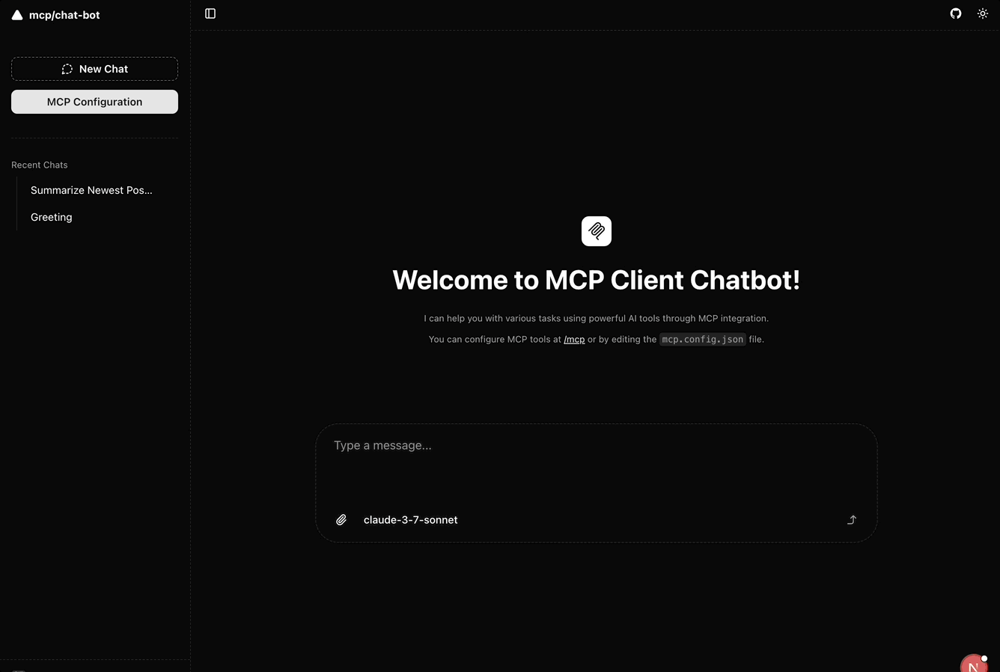
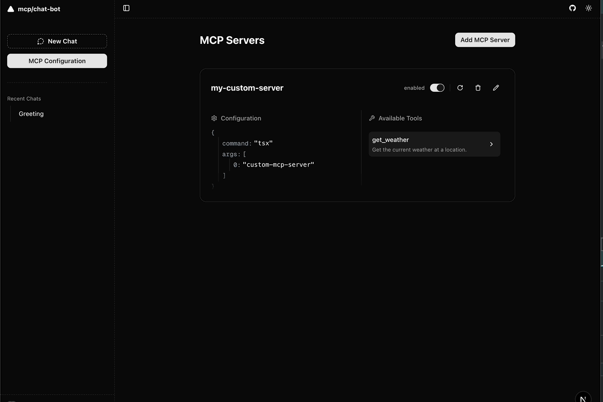

# MCP Client Chatbot

**MCP Client Chatbot**은 [OpenAI](https://openai.com/), [Anthropic](https://www.anthropic.com/), [Google](https://ai.google.dev/), [Ollama](https://ollama.com/) 등 다양한 AI 제공업체를 간편하게 활용할 수 있는 채팅 인터페이스입니다.  
또한 [Model Context Protocol (MCP)](https://modelcontextprotocol.io/introduction)을 통해 다양한 강력한 AI 도구들을 손쉽게 연결할 수 있습니다.

> 이 프로젝트는 [Next.js](https://nextjs.org/), [AI SDK](https://sdk.vercel.ai/), [shadcn/ui](https://ui.shadcn.com/) 등 Vercel의 오픈소스 라이브러리를 기반으로 개발되었으며, 복잡한 설정 없이 로컬 환경이나 개인 서버에서도 즉시 실행할 수 있도록 설계되었습니다. 파일 기반 MCP 관리 방식을 통해 AI 도구를 쉽게 추가하고 실험할 수 있습니다.

  
*Microsoft의 [playwright-mcp](https://github.com/microsoft/playwright-mcp)와 통합된 MCP 클라이언트 챗봇 데모*

**사용 프롬프트 예시:**  
`"Reddit에 접속해서 r/mcp를 열고, 가장 최근 글을 확인한 다음 어떤 내용인지 말해줘 — 그리고 다 끝났으면 Reddit을 닫아줘."`

---

## 설치 방법

이 프로젝트는 [pnpm](https://pnpm.io/)을 권장 패키지 매니저로 사용합니다.

### 빠른 시작

```bash
# 의존성 설치
pnpm i

# 프로젝트 초기화 (.env 파일 생성 및 DB 설정 포함)
pnpm initial

# 개발 서버 실행
pnpm dev
```

위 명령어 실행 후, [http://localhost:3000](http://localhost:3000)에서 애플리케이션을 확인할 수 있습니다.

---

### 환경 변수 설정

`pnpm initial` 명령어를 실행한 뒤, `.env` 파일을 열어 사용하려는 AI 제공업체의 API 키를 추가하세요:

```
GOOGLE_GENERATIVE_AI_API_KEY=****
OPENAI_API_KEY=****
```

기본적으로 SQLite를 데이터 저장소로 사용하며, PostgreSQL을 사용하고 싶다면 `.env` 파일의 `USE_FILE_SYSTEM_DB` 값을 수정하고 데이터베이스 연결 문자열을 설정하면 됩니다.

---

### MCP 서버 설정

MCP 서버는 다음과 같은 방식으로 추가할 수 있습니다:

1. **UI를 통해 추가**  
   브라우저에서 [http://localhost:3000/mcp](http://localhost:3000/mcp)로 이동하여 UI를 통해 MCP 서버를 추가 및 구성할 수 있습니다.

2. **설정 파일 직접 수정**  
   프로젝트 루트에 있는 `mcp.config.json` 파일을 직접 수정해 MCP 서버를 구성할 수 있습니다.

3. **커스텀 서버 로직 작성**  
   프로젝트에는 기본적으로 커스터마이징 가능한 MCP 서버가 `./custom-mcp-server/index.ts`에 포함되어 있습니다.  
   이 파일을 수정하여 직접 서버 로직을 구현하거나 외부 도구와 연동할 수 있습니다.




## 가즈아 🚀

---

## 기여하기

👉 Check out our [Roadmap](./ROADMAP.md) to see what’s coming up!

> MCP 클라이언트 챗봇 프로젝트에 대한 기여는 언제나 환영입니다!  
> 버그 제보, 기능 제안, 코드 기여 등 여러분의 도움이 프로젝트를 더욱 멋지게 만듭니다.
