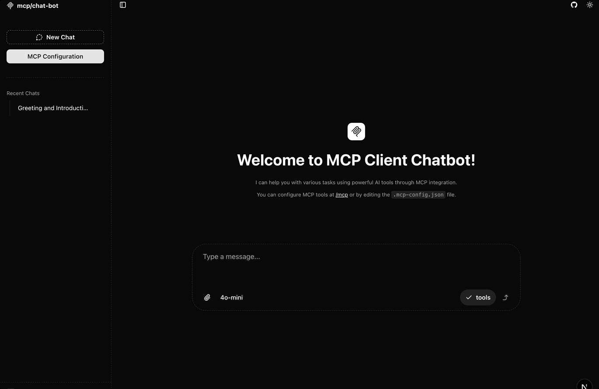
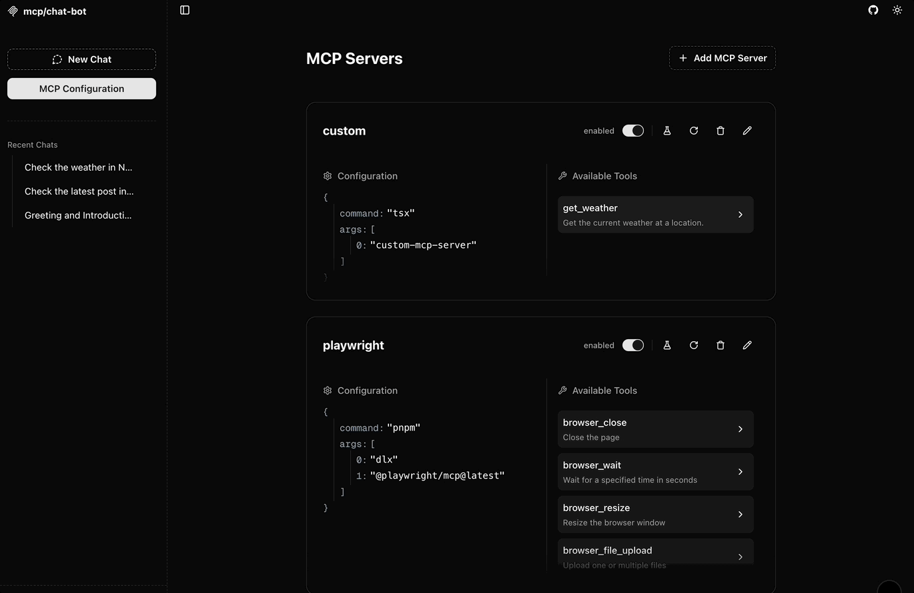
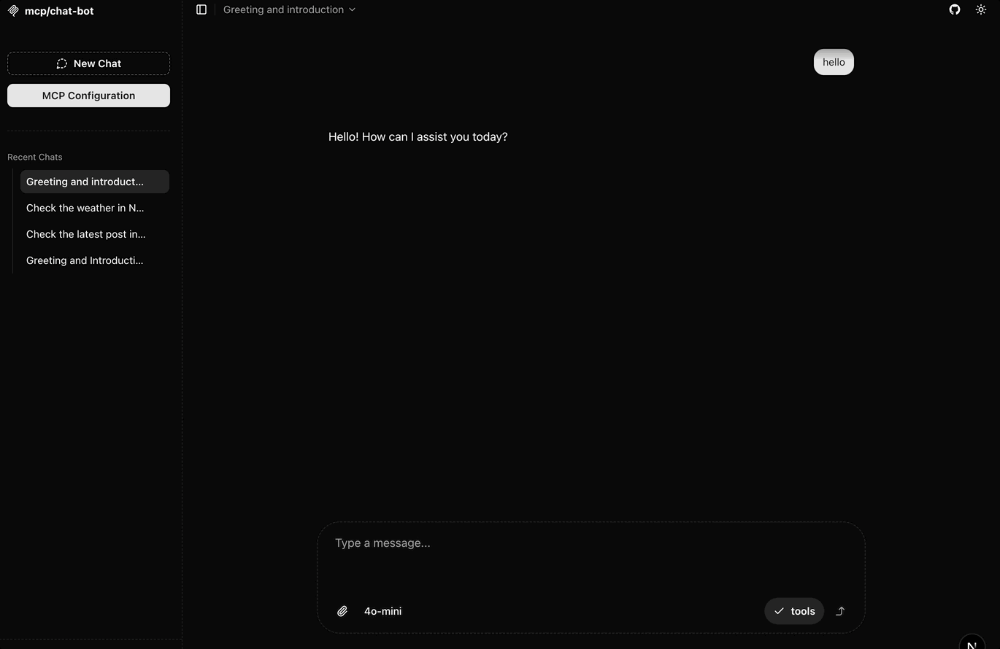

# MCP Client Chatbot: 로컬 기반 AI 어시스턴트 앱

[](#) 
[](https://modelcontextprotocol.io/introduction)

**MCP Client Chatbot**은 [OpenAI](https://openai.com/), [Anthropic](https://www.anthropic.com/), [Google](https://ai.google.dev/), [Ollama](https://ollama.com/) 등 다양한 AI 모델 프로바이더를 손쉽게 활용할 수 있는 다재다능한 채팅 인터페이스입니다. **무엇보다 100% 로컬 환경에서 복잡한 설정 없이 즉시 실행**할 수 있도록 설계되어, 개인 컴퓨터나 서버에서 **편리하게 컴퓨팅 자원을 활용하고 모든 것을 직접 제어**할 수 있습니다.

> 이 앱은 [Vercel AI SDK](https://sdk.vercel.ai)와 [Next.js](https://nextjs.org/)를 기반으로 구축되었으며, 최신 AI 챗 인터페이스 개발 방식을 반영합니다.
[Model Context Protocol (MCP)](https://modelcontextprotocol.io/introduction)을 통해 강력한 외부 AI 도구들을 매끄럽게 연결하고 활용하여 채팅 경험을 극대화하세요.

> **우리의 목표:** 누구나 쉽게 사용할 수 있는, 개인에게 최적화된 AI 챗봇 앱을 만드는 것입니다.

## 목차

- [MCP Client Chatbot: 로컬 기반 AI 어시스턴트 앱](#mcp-client-chatbot-로컬-기반-ai-어시스턴트-앱)
  - [목차](#목차)
  - [데모](#데모)
  - [✨ 핵심 기능](#-핵심-기능)
  - [🚀 빠른 시작](#-빠른-시작)
    - [환경 변수 설정](#환경-변수-설정)
    - [MCP 서버 설정](#mcp-서버-설정)
  - [💡 활용 사례](#-활용-사례)
  - [🗺️ 로드맵: 앞으로 추가될 기능들](#️-로드맵-앞으로-추가될-기능들)
  - [🙌 기여하기](#-기여하기)

-----

## 데모


**간편한 도구 호출:** 메시지 입력창에서 '@' 기호를 사용하여 사용 가능한 MCP 도구를 쉽게 선택하고 호출할 수 있습니다.

---



**MCP 도구 연동 예시:** Microsoft의 [playwright-mcp](https://github.com/microsoft/playwright-mcp)와 통합하여 웹 브라우저를 제어하는 모습입니다. 

*예시 프롬프트:* "Reddit에 접속해서 r/mcp를 열고, 가장 최근 글을 확인한 다음 어떤 내용인지 말해줘 — 그리고 다 끝났으면 Reddit을 닫아줘."

---



**독립적인 도구 테스트:** 채팅 흐름과 별개로 MCP 도구의 기능을 개별적으로 테스트하고 결과를 확인할 수 있습니다.

---



**모델 & 도구 선택 UI:** 프롬프트 입력창에 LLM 선택 버튼, MCP 도구 목록과 활성 상태를 즉시 확인하고 제어할 수 있습니다.

-----

## ✨ 핵심 기능

* **💻 100% 로컬 실행:** 복잡한 배포 과정 없이 개인 PC나 서버에서 바로 실행하여 **컴퓨팅 자원을 직접 활용하고 모든 과정을 제어합니다.**
* **🤖 다양한 AI 모델 지원:** OpenAI, Anthropic, Google AI, Ollama 등 원하는 AI 공급자를 자유롭게 선택하고 연결하세요.
* **🛠️ 강력한 MCP 통합:** Model Context Protocol을 통해 외부 도구(웹 브라우저 자동화, 데이터베이스 연동 등)를 채팅에 손쉽게 통합하고 활용합니다.
* **🚀 MCP 도구 단독 테스트:** 채팅과 별개로 MCP 도구의 요청/응답을 직접 테스트하여 개발 및 디버깅 효율을 높입니다.
* **💬 직관적인 도구 멘션:** 채팅 입력창에서 `@` 키를 눌러 사용 가능한 MCP 도구를 즉시 확인하고 선택하여 호출할 수 있습니다.
* **⚙️ 쉬운 서버 설정:** 사용자 친화적인 UI 또는 간단한 `.mcp-config.json` 파일 수정을 통해 MCP 서버 연결을 간편하게 관리합니다.
* **📄 마크다운 UI:** 깔끔하고 가독성 높은 인터페이스에서 마크다운 형식의 대화를 주고받을 수 있습니다.
* **💾 제로 설정 로컬 DB:** 기본 SQLite 데이터베이스를 사용하여 별도 설정 없이 대화 내역 등을 로컬에 저장합니다 (PostgreSQL 옵션도 제공).
* **🧩 커스텀 MCP 서버 지원:** 내장된 MCP 서버 코드를 직접 수정하여 나만의 도구를 만들거나 로직을 확장할 수 있습니다.


## 🚀 빠른 시작

이 프로젝트는 [pnpm](https://pnpm.io/)을 권장 패키지 매니저로 사용합니다.

```bash
# 1. 의존성 설치
pnpm i

# 2. 프로젝트 초기화 (.env 파일 생성 및 DB 설정 포함)
pnpm initial

# 3. 개발 서버 실행
pnpm dev
```

위 명령어를 실행한 후, 웹 브라우저에서 [http://localhost:3000](https://www.google.com/search?q=http://localhost:3000)으로 접속하여 애플리케이션을 확인하세요.

-----

### 환경 변수 설정

`pnpm initial` 명령어를 실행하면 프로젝트 루트에 `.env` 파일이 생성됩니다. 이 파일을 열어 사용하려는 AI 제공업체의 API 키를 추가하세요:

```dotenv
GOOGLE_GENERATIVE_AI_API_KEY=****
OPENAI_API_KEY=****
# ANTHROPIC_API_KEY=****
```

기본적으로 데이터는 로컬 SQLite 파일(`db.sqlite`)에 저장됩니다. PostgreSQL 사용을 원하시면 `.env` 파일의 `USE_FILE_SYSTEM_DB=false`로 변경하고 `DATABASE_URL`을 설정하세요.

-----

### MCP 서버 설정


MCP 서버(도구)를 연결하는 방법은 다양합니다:

1.  **UI 활용:** http://localhost:3000/mcp 페이지에서 그래픽 인터페이스를 통해 MCP 서버를 추가하고 관리합니다.
2.  **설정 파일 직접 수정:** 프로젝트 루트의 `.mcp-config.json` 파일을 직접 편집하여 MCP 서버 정보를 구성합니다.
3.  **커스텀 서버 로직 작성:** 프로젝트 내 `./custom-mcp-server/index.ts` 파일을 수정하여 자신만의 MCP 서버 로직을 구현하거나 외부 도구와 연동할 수 있습니다.


-----

## 💡 활용 사례


  * [Supabase Integration](./use-cases/supabase.md) - MCP를 사용해 Supabase 데이터베이스 조작, 인증, 실시간 기능을 활용하는 방법을 알아보세요.

-----

## 🗺️ 로드맵: 앞으로 추가될 기능들

MCP Client Chatbot을 더욱 강력한 개인 AI 비서로 만들기 위해 다음과 같은 기능들을 계획하고 있습니다:

  * **🎨 Canvas 기능:** 협업 Canvas 기능: LLM이 생성한 결과물(코드, 블로그 글, 텍스트 등)을 사용자와 LLM이 함께 실시간으로 편집하고 발전시킬 수 있는 인터페이스.
  * **🧩 LLM UI 생성:** LLM이 직접 차트, 테이블, 폼 등 동적인 UI 컴포넌트를 생성하여 보여주는 기능.
  * **📜 규칙(Rule) 기능:** 채팅 세션 전반에 적용될 수 있는 사용자 정의 시스템 프롬프트 또는 규칙 설정.
  * **🖼️ 이미지 생성 및 파일 업로드:** 이미지 생성 요청 및 파일(문서, 이미지 등) 업로드를 통한 멀티모달 상호작용 지원.
  * **🐙 GitHub 프로젝트 마운트:** 로컬의 GitHub 저장소를 마운트하여 코드 관련 질문 및 작업 수행.
  * **📚 RAG 에이전트:** 자체 문서나 데이터를 기반으로 답변을 생성하는 Retrieval-Augmented Generation 기능.
  * **🧠 플래닝 에이전트:** 복잡한 작업을 단계별로 계획하고 실행하는 더욱 지능적인 에이전트 구현.
  * **🧑‍💻 에이전트 생성 기능:** 사용자가 특정 목적을 가진 맞춤형 AI 에이전트를 쉽게 정의하고 생성할 수 있는 도구.

👉 전체 로드맵은 [ROADMAP.md](./ROADMAP.md)에서 확인하세요\!

-----

## 🙌 기여하기


MCP Client Chatbot 프로젝트에 기여해주실 분들을 언제나 환영합니다\! 버그 제보, 새로운 기능 제안, 코드 개선 등 어떤 형태의 기여든 좋습니다. 여러분의 도움으로 이 프로젝트를 더욱 멋지게 만들 수 있습니다.

함께 최고의 개인 AI 어시스턴트를 만들어가요\!