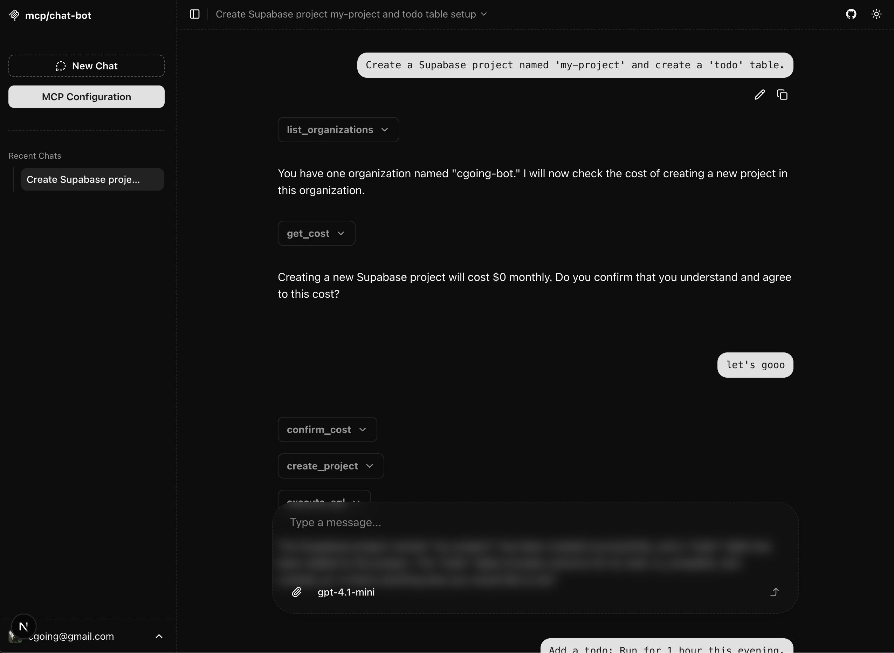
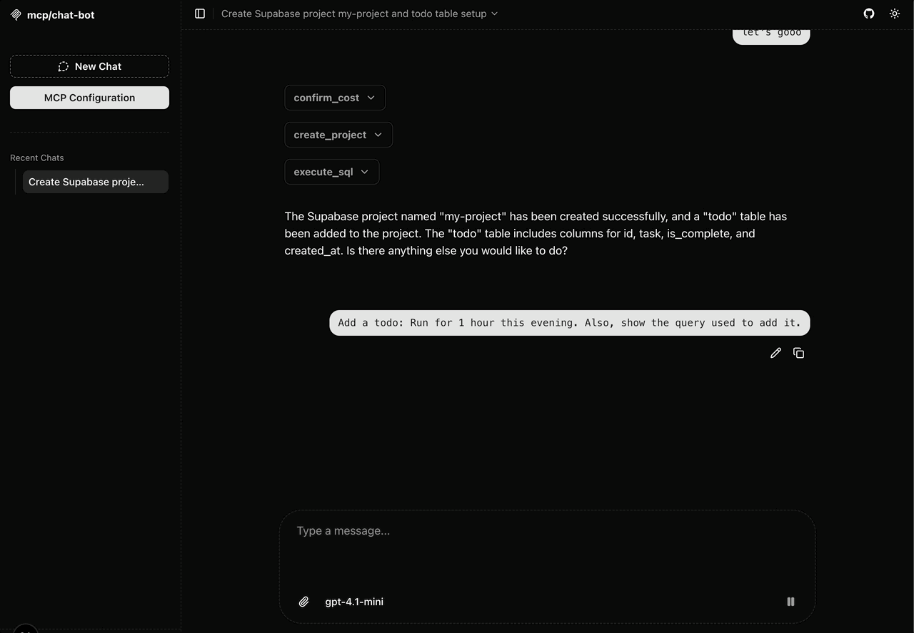

# Supabase Todo with MCP

This guide demonstrates how to use [Supabase's MCP Server](https://supabase.com/docs/guides/getting-started/mcp?queryGroups=os&os=mac) to handle a simple `todo` use case with an LLM chatbot.

#### ✅ Configuration

The following MCP config was used to enable Supabase as the backend server:

```json
{
  "command": "npx",
  "args": [
    "-y",
    "@supabase/mcp-server-supabase@latest",
    "--access-token",
    "<personal-access-token>"
  ]
}
```

---

#### Prompt

```txt
Create a Supabase project named 'my-project' and create a 'todo' table.
```



#### 🗣️ Chatbot Response

> _"Creating a new Supabase project will cost $0 monthly. Do you confirm that you understand and agree to this cost?"_

---

#### Prompt

```txt
Add a todo: Run for 1 hour this evening. Also, show the query used to add it.
```



#### 🗣️ Chatbot Response

> The todo "Run for 1 hour this evening" has been added to the "todo" table.
> The query used to add it is:

```sql
INSERT INTO todo (task, is_complete) VALUES ('Run for 1 hour this evening', FALSE);
```

---
